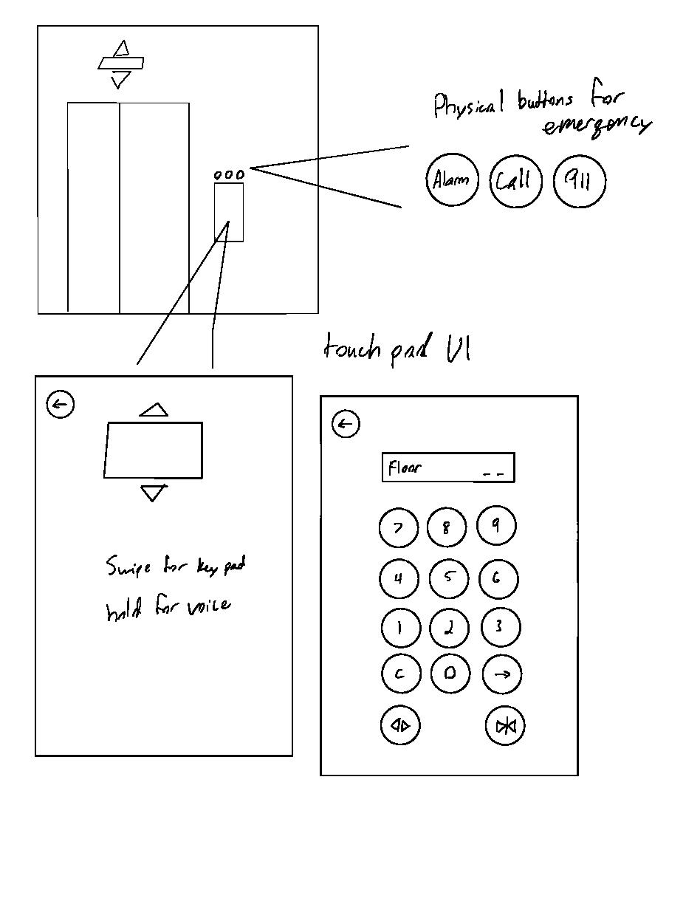

# ElevatorUI
Elevator UI Homework

Picture of Elevator Control Panel

Gif of use

Issues with current design
* Alarm button could be easily reached by a small child
* Basement doors could be misinterpreted
* They symbols for open and close doors can be a bit confusing
* No sound feedback to notify destination being reached

Common Use/Rare Use
* To get to a higher or lower floor by means other than the stairs
* Transport objects to higher or lower floors that would otherwise be difficult or impossible with stairs
* To reach floors unreachable by stairs
* Social experiments
* To obtain the high ground

Common sequence of actions
1. Press the button indicating the direction you wish you go (up or down)
2. Enter the elevator
3. Press the button designated for the floor you wish to reach
4. Optional, press the close door button 
5. Wait until the elevator reaches the floor you designated
6. Exit the elevator

The design of the elevator should be layed out in such a way that the user can intuitively know what to do to operate the elevator without the use of an instruction manual.

The elevator providing feedback allows the user to know that the buttons work and that the elevator is working properly. Without feedback the user could be pressing a dead button without ever knowing.

Common mistakes would include, since it is a two door design, mixing which open/close door goes to which. Typically a user will be pushing the open/close door without knowing that they are pushing the button for the wrong set of doors, which will lead them to believe that the elevator is broken.

How it could be better
* clearly label the open/close door button for their respective doors and mark said doors to match the buttons
* Move the help/call button higher along with the speaker for better accessibility, audio quality and visibility
* Move the Alert button higher along with all of the other emergency buttons
* Add sound feedback to notify passengers that a floor has been reached or that the doors are opening or closing

Elevator UI sketch/design

[Elevator Touch Pad UI Demo](https://xd.adobe.com/spec/880cc329-65b5-48cc-538f-11af888835d9-fe3d/ )

Touch Pad Demo Walkthrough
1. "Swipe" to proceed to the keypad.
2. HIt 4 on the keypad, then hit enter.
3. While in transition you may still swipe to go to the keypad, or wait until floor is reached to swipe.
4. At this keypad hit 2 to go to the second floor.
5. Swipe once again to bring up the keypad.
6. This time, hit 1, then 0, but instead of hitting enter hit clear.
7. After this hit enter and from here you may either swipe to enter the keypad again or "hold" (tap) to enter voice.
8. At the voice screen you may tap again to go back to the main screen, this is to symbolize your voice input and tapping for entry (But   this is solely to show UI design so the function itself does not work.)
9. Similar with the keypad at this point in time it is just to show that this is what you can do with the base UI.
